<h1 align="center">⛏️ Digging Jim</h1>

<p align="center">
  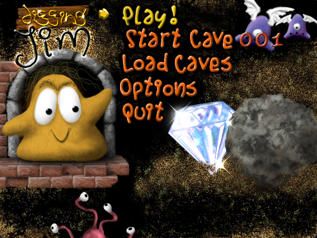
</p>

<p align="center">
  <a href="../../releases"></a>
  
  
  
</p>

<p align="center">
  A fan-made C++ remake of <strong>Digging Jim</strong> — a Boulder Dash‑style game originally developed by <em>Persei Entertainment</em> in 1999.
  <br>
  The original no longer runs well on modern hardware, and was Windows-only. This remake brings Jim back faithfully — and cross-platform to Windows, Linux, and macOS!
</p>

---

## 🎮 Download & Play

**No build required.** Grab the latest release for your platform from the [**Releases**](../../releases) page, extract the zip, and you're in.

| Platform | Instructions |
| :--- | :--- |
| **Windows** | Run `DiggingJim.exe` directly — no setup needed. |
| **Linux** | Install runtime libs (see below), then `./DiggingJim` |
| **macOS** | Install wxWidgets via Homebrew (see below), then `./DiggingJim` |

<details>
<summary><strong>Linux runtime dependencies</strong></summary>

**Ubuntu / Debian (modern):**
```bash
sudo apt-get install libopenal1 libflac12t64 libvorbis0a libogg0 libfreetype6 libwxgtk3.2-1t64
./DiggingJim
```

**Ubuntu / Debian (older — if the above packages aren't available):**
```bash
sudo apt-get install libopenal1 libflac8 libvorbis0a libogg0 libfreetype6 libwxgtk3.0-gtk3-0v5
./DiggingJim
```

**Fedora / RHEL:**
```bash
sudo dnf install openal-soft flac-libs libvorbis libogg freetype wxGTK
./DiggingJim
```

**Arch:**
```bash
sudo pacman -S openal flac libvorbis libogg freetype2 wxwidgets-gtk3
./DiggingJim
```

</details>

<details>
<summary><strong>macOS runtime dependencies</strong></summary>

```bash
brew install wxwidgets
./DiggingJim
```

</details>

---

## 🕹️ Gameplay

<p align="center">
  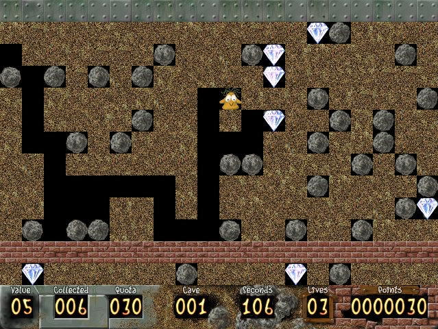
</p>

You are **Jim**. Jim digs. Jim collects diamonds. Jim tries very hard not to get crushed.

Each cave presents a grid of dirt, rocks, enemies, and glittering diamonds. To escape, Jim must collect enough diamonds to meet the **diamond quota** and reach the **exit door** — all before the **cave timer** hits zero. Simple in theory; lethal in practice.

<p align="center">
  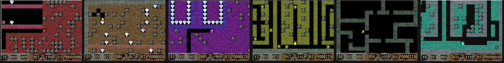
</p>

### What stands in Jim's way

| | Entity | Description |
| :---: | :--- | :--- |
| 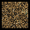 | **Dirt** | The most common formation. Jim can dig through it, but it stops everything else except amoeba. |
| 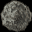 | **Boulder** | Falls if unsupported and rolls off unstable surfaces like diamonds, other boulders, and brick walls. Dangerous when falling, but useful for hitting enemies. Jim can push them sideways with a little effort. |
|  | **Diamond** | Jim's goal. Collect enough to meet the quota and unlock the exit. Behaves much like a boulder — watch your head. |
|  | **Fragile Diamond** | As valuable as a normal diamond, but shatters if it falls or is hit by a falling object. |
| 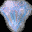 | **Granite Ore** | Falls like a boulder. Hit it with a boulder and a diamond will appear! |
| 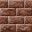 | **Wall** | Normal brick wall. Can be destroyed by explosions. Boulders roll off it. |
| 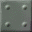 | **Solid Wall** | Reinforced wall. Cannot be destroyed in any way. |
| 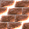 | **Magic Wall** | Inactive until struck by a boulder or diamond. Once active it converts boulders to diamonds and vice versa, for a cave-specific duration. After it expires it simply dissolves whatever passes through. |
|  | **Expanding Wall** | Comes in horizontal and vertical variants. Expands along its axis into free space — sometimes used as a trap, so watch out. |
|  | **Plasma** | Expands randomly in all directions through free space at a cave-specific speed. Often quite fast — be careful when releasing it or you may get trapped. |
|  | **Amoeba** | Spreads through dirt and free space at a cave-specific speed. Kills all creatures except Jim. Turns to boulders when it reaches its size limit — but if Jim manages to fully enclose it so it can no longer grow, it transforms into diamonds instead. |
| 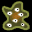 | **Protozo** | Common cave critter. Moves through free space, turning left whenever possible. Deadly on contact with Jim. When hit by a falling object it explodes, which is useful for clearing brick walls and obstacles. |
| 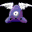 | **Cave Gull** | Moves through free space, turning right whenever possible. Hit one with a falling object or let amoeba reach it — its explosion yields 9 diamonds. Still as deadly as a Protozo if it reaches Jim. |
| 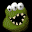 | **Eater** | A two-headed menace. Turns right through free space and will gorge itself on diamonds — get rid of them before they eat your quota. |
| 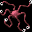 | **Aggressor** | Rare but terrifying. Uses acute senses to actively hunt Jim. Not very clever though — complex obstacles can throw them off. |
| 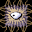 | **Cilia** | Moves in straight lines and picks a random direction when it hits an obstacle. |
|  | **TNT Box** | Left by long-forgotten miners. Can be pushed like a boulder. When the Detonator is activated, every TNT box in the cave explodes — make sure they're in the right place first. |
| 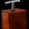 | **Detonator** | Touch it to trigger every TNT box in the cave simultaneously. |
| 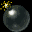 | **Drop Bomb** | Extremely sensitive. Goes off if any object hits it, or if it falls and lands on something. |
| 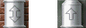 | **Tubes** | Bi-directional tubes let Jim pass from either side; one-way tubes only allow entry from one end. Only Jim can move through tubes. |
| 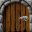 | **Start Door** | Jim enters the cave through here at the beginning of each level. |
| 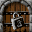 | **Exit Door** | Locked until Jim collects enough diamonds. Reach it to advance to the next cave — don't let it get caught in an explosion. |

### Controls

| Keyboard | Controller / Joystick | Action | Description |
| :--- | :--- | :--- | :--- |
| `Arrow Keys` / `W` `A` `S` `D` | `Analog Stick` | Move / Navigate | Move Jim. Hold against a boulder for 1 second to push it. Also navigates the Main Menu. |
| `Enter` | `A` / `Cross` / `Button 0` | Select / Confirm | Confirm menu selections. Restart cave after death. |
| `Space` | `X` / `Square` / `Button 2` | Collect Mode | Dig or collect in an adjacent tile without stepping into it. Great for grabbing diamonds safely. |
| `Tab` | `B` / `Circle` / `Button 1` | Self-Destruct | Instantly restart the cave when Jim is hopelessly trapped. |
| `Esc` | `Back` / `Select` / `Button 6` | Quit | Return to the Main Menu. |
| `P` | `Start` | Pause / Resume | Pause the cave. |

---

## ⚡ Features

- **Faithful recreation** of all 100 original Persei Entertainment caves
- **Cross-platform** — Windows, Linux (x64 & ARM64), and macOS
- **Controller & joystick support** added alongside original keyboard controls
- **Cave Editor** — build your own cave files with a full GUI editor (undo/redo; cave properties; test-in-game; developer mode for extended tools)
- **Original `.cav` file format** — backwards-compatible with cave files from the original 1999 game
- **Per-cave colour theming** — hue, saturation, and luminance controls per cave
- **Animated tiles** — amoeba, magic walls, plasma, and more all animate in-game
- **Sound effects** — original sound design recreated for every entity interaction

---

## 🕵️ Cheat Mode

The original game had a cheat mode activated with `F12`. This remake maps activation to `F11`, and expands the available cheats.

Press `F11` to activate, then:

| Key | Action |
| :--- | :--- |
| `F1` | Go to next cave |
| `F2` | Restart current cave (new) |
| `F3` | Go to previous cave (new) |

> Cave navigation in the Main Menu also steps by 1 (instead of 5) while cheat mode is active.

---

## 🔧 Cave Editor

<p align="center">
  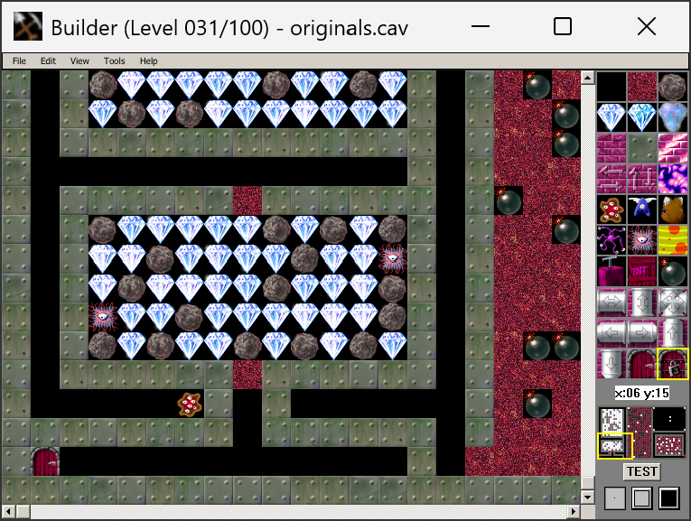
</p>

The editor lets you create and edit `.cav` files — the same format used by the original 1999 game. Features include:

- Place any cave entity using a tile panel
- **Rectangle fill** — drag to fill a region; middle-click for outline, right-click for solid fill
- Scroll and zoom the cave view
- Edit cave properties (timer, diamond quota, amoeba speed, magic wall duration, colour, and more)
- Test the cave directly in the game from within the editor
- Save, open, and manage multi-cave `.cav` files

### Developer Mode

Press `Ctrl+D` in the editor to toggle developer mode. This unlocks:

- **Cave resizing** — set cave dimensions freely, from as small as 20×13 up to 255×255 (default is 50×30)
- **Additional fill modes** — Line fill and Ellipse fill (outline and solid variants)

When testing a cave from the editor with developer mode active, the game also launches in developer mode. This enables additional F-keys on top of the standard cheat mode ones (both cheat mode and developer mode must be active):

| Key | Action |
| :--- | :--- |
| `F4` | Open Cave Properties window |
| `F6` | Move camera target left |
| `F7` | Move camera target up |
| `F8` | Move camera target down |
| `F9` | Move camera target right |
| `F10` | Reset camera target to Jim |

---

## 🏗️ Building from Source

### Prerequisites

- CMake 3.16+
- A C++17-capable compiler (MSVC, GCC, Clang)
- Platform dependencies (see below)

**Windows** — SFML and wxWidgets are pulled via vcpkg automatically during configure.

**Linux:**
```bash
sudo apt-get install libxrandr-dev libxcursor-dev libxi-dev libudev-dev \
  libgl1-mesa-dev libegl1-mesa-dev libopenal-dev \
  libflac-dev libvorbis-dev libogg-dev libfreetype-dev libwxgtk3.2-dev
```

**macOS:**
```bash
brew install wxwidgets
```

### Build

```bash
cmake -B build -DBUILD_SHARED_LIBS=FALSE
cmake --build build --config Release
```

Binaries land in `build/bin/`. Copy the `assets/` folder and a `caves/` directory alongside them before running.

---

## 🎖️ Credits

**Original Game (1999) — Persei Entertainment**
- Programming: **Peter Prøst**
- Graphics: **Robert Kjettrup**
- Sound: **Henrik Sundberg**, **Peter Prøst**
- Cave Design: **Robert Kjettrup**, **Peter Prøst**, **Anders Hansen**

**Remake (2025)**
- Recreation: **Christopher Malcolm**

> This project is a non-commercial fan tribute. It is not affiliated with or endorsed by Persei Entertainment. Please support the original release where possible.
